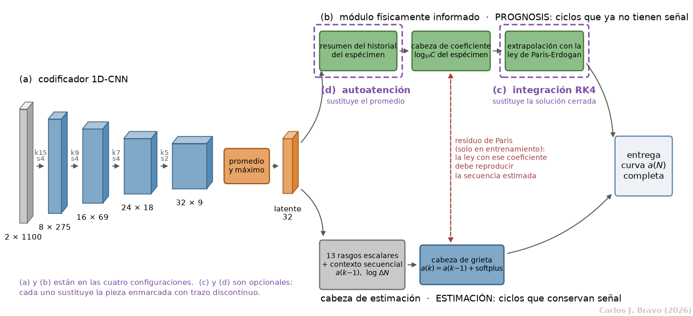
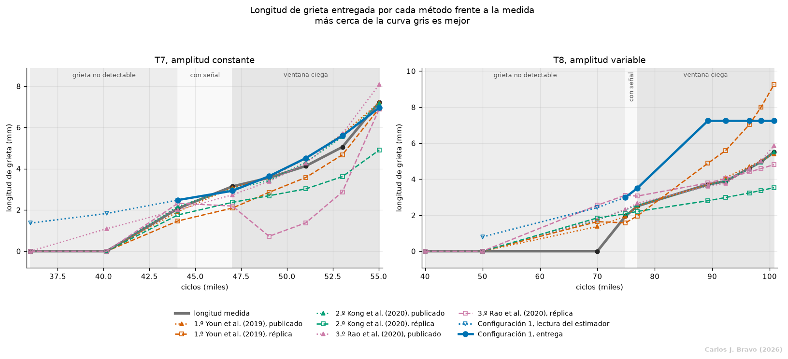
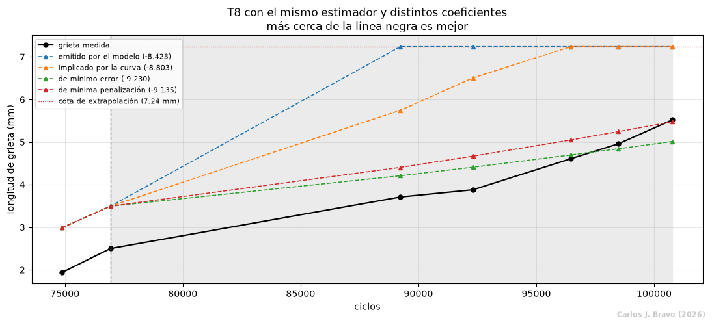
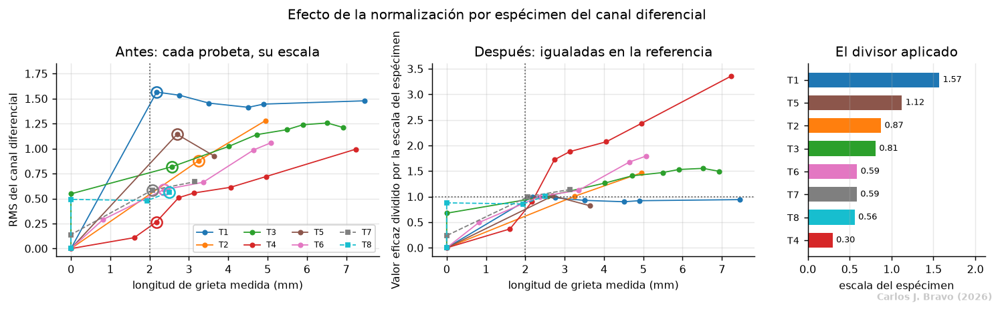
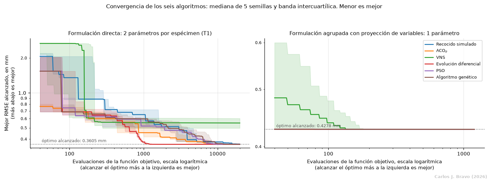

# Pronóstico de crecimiento de grietas por fatiga con ondas de Lamb

Trabajo Fin de Máster. Carlos J. Bravo I.

Modelo híbrido que acopla un codificador convolucional unidimensional (1D-CNN) con un módulo
físicamente informado (PINN) basado en la ley de Paris-Erdogan, aplicado a uniones traslapadas
remachadas de aluminio 2024-T3 del [PHM Data Challenge 2019](https://data.phmsociety.org/2019datachallenge/).
El problema tiene dos tareas: **estimar** la longitud de grieta mientras existe señal ultrasónica y
**pronosticarla** cuando esa señal deja de estar disponible.

## Resultados principales

| | T7 (amplitud constante) | T8 (amplitud variable) | Total |
|---|---:|---:|---:|
| Configuración 1 (1D-CNN + PINN) | **6.49** | 90.45 | **96.94** |
| Réplica del 1.er puesto, Youn et al. | 22.71 | 91.60 | 114.31 |
| Réplica del 2.º puesto, Kong et al. | 83.25 | 148.34 | 231.60 |
| Réplica del 3.er puesto, Rao et al. | 215.12 | 25.79 | 240.91 |

Penalización oficial del certamen: adimensional, menor es mejor.

- La configuración base queda por delante de las tres réplicas en el total, y en T7 alcanza una
  penalización del orden de las publicadas por los ganadores, con un error cuadrático medio de
  0.350 mm.
- Ninguno de los dos componentes opcionales, el predictor multi-paso por integración RK4 y la
  autoatención sobre la secuencia de ciclos, aporta una mejora atribuible. Lo que sostiene el
  rendimiento es la función de pérdida asimétrica.
- En T8 el error se concentra en el coeficiente de la ley de crecimiento, que cae 0.602 décadas
  fuera de la banda admisible. La corrección no es deducible de los datos, porque ningún espécimen
  de entrenamiento se ensayó con amplitud variable.
- Las réplicas de los tres métodos ganadores, reconstruidas a partir de sus artículos, quedan entre
  quince y treinta veces por encima de las cifras publicadas.
- Los parámetros de la ley de Paris-Erdogan no están publicados para estos especímenes y se
  identificaron comparando seis algoritmos metaheurísticos: la evolución diferencial alcanza el
  mejor óptimo en 132 de 180 ejecuciones, frente a 49 del algoritmo genético que emplea el certamen.

## Arquitectura



Los componentes (a) y (b) están presentes en las cuatro configuraciones. El (c) y el (d) son
opcionales y cada uno sustituye una pieza del módulo físico, lo que permite el estudio de ablación.

## Figuras destacadas

**Curvas entregadas frente a la longitud medida, con las tres referencias del certamen.**



**Efecto del coeficiente en T8.** Con el coeficiente adecuado la misma red entregaría un resultado
seis veces mejor; el estimador no es la causa del error.



**Normalización del canal diferencial por espécimen.** Reduce la dispersión entre probetas en la
banda de 2 a 2.5 mm de un factor 5.9 a un factor 1.1.



**Convergencia de los seis algoritmos metaheurísticos.** Sobre la formulación directa el algoritmo
decide el resultado; con proyección de variables esa diferencia desaparece.



## Cuadernos

Cada cuaderno es un informe que calcula sus tablas y figuras al ejecutarse.

| Bloque | Cuaderno | Contenido |
|---|---|---|
| Datos | [`PHMDC2019_Data/`](PHMDC2019_Data/) | Conjunto del certamen: T1 a T6 de entrenamiento, T7 y T8 de validación ([fuente oficial](https://data.phmsociety.org/2019datachallenge/)) |
| Señal | [Tratamiento de la señal](tratamiento_senal/tratamiento_senal.ipynb) | Filtrado, alineación, ventaneo del modo S0, entrada diferencial y normalización por espécimen |
| Física | [Calibración física](physics_calibration/hiperparametros.ipynb) | Identificación de los parámetros de la ley de crecimiento con seis algoritmos metaheurísticos |
| Réplicas | [1.er puesto, Youn et al.](1st_place_baseline/1st_place_baseline.ipynb) | SVR con *trans-fitting* |
| | [2.º puesto, Kong et al.](2nd_place_baseline/2nd_place_baseline.ipynb) | Bosque aleatorio con ley de Walker y Monte Carlo |
| | [3.er puesto, Rao et al.](3rd_place_baseline/3rd_place_baseline.ipynb) | Regresión lineal con ley de Paris ajustada por algoritmo genético |
| Configuraciones | [Configuración 1](config1_cnn_pinn/configuracion1.ipynb) | Codificador 1D-CNN y módulo físicamente informado, la base |
| | [Configuración 2](config2_rk4/configuracion2.ipynb) | Predictor multi-paso por integración RK4, con y sin retardo de Wheeler |
| | [Configuración 3](config3_attention/configuracion3.ipynb) | Autoatención sobre la secuencia de ciclos |
| | [Configuración 4](config4_completa/configuracion4.ipynb) | Ambos componentes opcionales y cierre del estudio de ablación |

## Protocolo

- **Selección:** validación cruzada dejando un espécimen fuera sobre T1, T3, T4 y T6. T7 y T8 no
  intervienen en ninguna búsqueda de hiperparámetros.
- **Evaluación:** protocolo del certamen sobre T7 y T8, con dos medidas de grieta no nula antes del
  corte de señal y puntuación con la penalización oficial.
- **Atribución:** cada configuración se entrena en varias tandas de semillas, y una diferencia solo
  se atribuye a un componente cuando los recorridos de ambas variantes no se solapan.

## Instalación

Se requiere Python 3.12. Todos los entrenamientos se ejecutaron sin unidad de procesamiento gráfico
y el conjunto de cinco semillas de la Configuración 1 se entrena en unos 82 segundos, de modo que
basta un ordenador personal.

```bash
git clone https://github.com/carlosbravo1408/TFMProject.git
cd TFMProject
python3.12 -m venv .venv
source .venv/bin/activate
pip install -r requirements.txt
```

`requirements.txt` fija las versiones con las que se verificaron los cuadernos e instala la
distribución de PyTorch para CPU. El conjunto de datos del certamen ya está incluido en
[`PHMDC2019_Data/`](PHMDC2019_Data/), así que no hace falta descargarlo aparte. Los cuadernos usan
el núcleo `python3` del entorno virtual:

```bash
jupyter lab
```

## Reproducción

Los resultados intermedios (`*/results/`) no se versionan. Los generan los scripts de cada paquete,
y los cuadernos de la calibración física y de las Configuraciones 1 a 3 los leen. Desde la raíz del
repositorio:

```bash
# 1. Calibración física (la etapa A-E tarda unas dos horas y media)
python -m physics_calibration.calibrate
python -m physics_calibration.anchor_sweep
python -m physics_calibration.exponent_sweep
python -m physics_calibration.make_priors

# 2. Configuración 1 (scripts independientes entre sí)
for m in select_weighting select select_prognosis busqueda_pesos cota_extrapolacion \
         hyperparameter_sources robustez_literatura t8_study control_rf evaluate; do
    python -m config1_cnn_pinn.$m
done

# 3. Configuraciones 2 y 3
python -m config2_rk4.sensitivity
python -m config3_attention.evaluate
```

Después se ejecutan los cuadernos, con la Configuración 1 antes que las demás, porque registra la
configuración de partida que las otras tres heredan. Los cuadernos de tratamiento de la señal y de
las réplicas no dependen de ningún paso previo. Los pesos entrenados se guardan en `models/` la
primera vez y se reutilizan en ejecuciones posteriores.

## Cita

Si este trabajo o su código le resultan útiles, cítelo como:

```bibtex
@mastersthesis{bravo2026grietas,
  author = {Bravo Intriago, Carlos Javier},
  title  = {Estimación y predicción del crecimiento de grietas por fatiga en uniones de aluminio
            a partir de redes neuronales convolucionales físicamente informadas},
  school = {Universidad Internacional de Valencia},
  type   = {Trabajo Fin de Máster, Máster Universitario en Inteligencia Artificial},
  year   = {2026},
  month  = sep,
  note   = {Dirigido por Jesús Marcey García},
  url    = {https://github.com/carlosbravo1408/TFMProject}
}
```

El conjunto de datos y los tres métodos ganadores que se replican deben citarse por separado:

```bibtex
@misc{liu2019phm,
  author       = {Liu, Y. and Peng, T.},
  title        = {Fatigue Crack Growth in Aluminum Lap-Joint Data Set ({PHM} 2019 Data Challenge)},
  howpublished = {PHM Society},
  year         = {2019},
  url          = {https://data.phmsociety.org/2019datachallenge/}
}

@article{youn2020transfitting,
  author  = {Youn, Myeongbaek and Kim, Yunhan and Lee, Dongki and Cho, Minki and Youn, Byeng D.},
  title   = {Fatigue Crack Length Estimation and Prediction Using Trans-fitting with Support Vector
             Regression},
  journal = {International Journal of Prognostics and Health Management},
  volume  = {11},
  number  = {1},
  year    = {2020},
  doi     = {10.36001/ijphm.2020.v11i1.2606}
}

@article{kong2020hybrid,
  author  = {Kong, Hyeon Bae and Jo, Soo-Ho and Jung, Joon Ha and Ha, Jong M. and Shin, Yong Chang
             and Yoon, Heonjun and Sun, Kyung Ho and Seo, Yun-Ho and Jeon, Byung Chul},
  title   = {A Hybrid Approach of Data-Driven and Physics-Based Methods for Estimation and
             Prediction of Fatigue Crack Growth},
  journal = {International Journal of Prognostics and Health Management},
  volume  = {11},
  number  = {1},
  pages   = {1--12},
  year    = {2020},
  doi     = {10.36001/ijphm.2020.v11i1.2605}
}

@article{rao2020ensemble,
  author  = {Rao, Meng and Yang, Xingkai and Wei, Dongdong and Chen, Yuejian and Meng, Lijun
             and Zuo, Ming J.},
  title   = {Structure Fatigue Crack Length Estimation and Prediction Using Ultrasonic Wave Data
             Based on Ensemble Linear Regression and {Paris's} Law},
  journal = {International Journal of Prognostics and Health Management},
  volume  = {11},
  number  = {2},
  year    = {2020},
  doi     = {10.36001/ijphm.2020.v11i2.2923}
}
```
